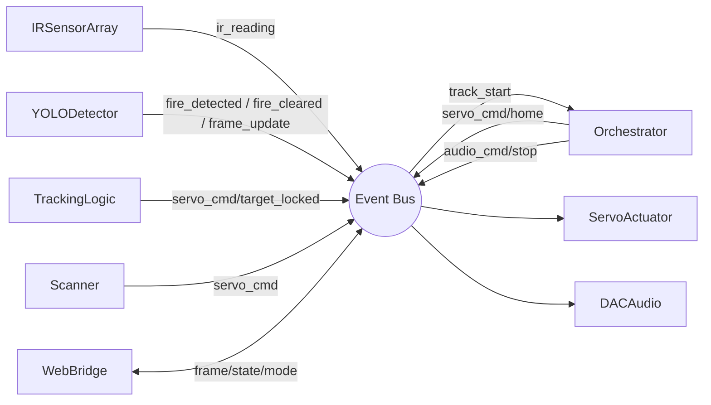
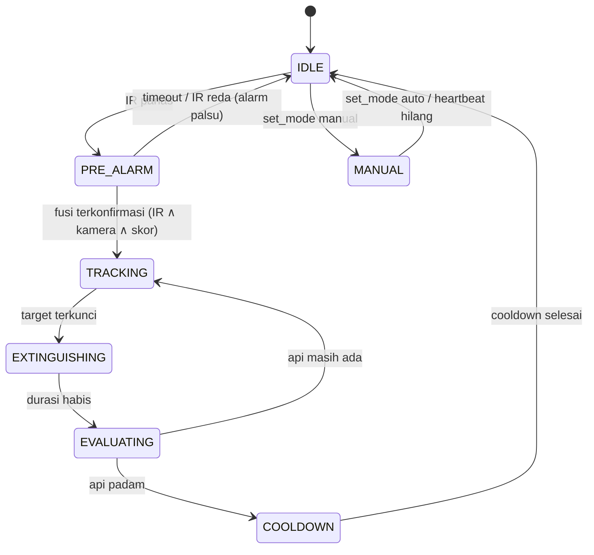

# Dokumentasi Sistem Terintegrasi S.A.F.E.

**S.A.F.E. (Smart Acoustic Fire Extinguisher)** — turret pemadam api akustik
berbasis Raspberry Pi. Dokumen ini menjelaskan **sistem produksi** di folder
`safe/`: hasil integrasi seluruh fungsi yang telah divalidasi bertahap di
`Program/` (lihat `Program/DOKUMENTASI_PENGUJIAN.md`) ke dalam satu arsitektur
event-driven yang utuh.

> **Alur singkat:** IR + kamera mendeteksi api → fusi sensor mengonfirmasi →
> turret 2-sumbu membidik → gelombang akustik 30–60 Hz memadamkan → evaluasi →
> cooldown. Saat siaga, turret menyapu area (scanning) mencari api.

---

## 1. Prinsip Arsitektur

Semua berjalan **dalam satu proses Python**. Modul-modul **tidak pernah saling
memanggil langsung** — mereka berkomunikasi lewat **Event Bus** (pub/sub).
Konsekuensinya:

- **Kontrak stabil:** setiap modul hanya tahu *nama event* + *bentuk payload*.
  `FakeDetector` dan `YOLODetector` menerbitkan payload identik, jadi bisa
  ditukar tanpa mengubah modul lain.
- **Single-writer:** Event Bus punya satu thread dispatcher, sehingga handler
  tidak pernah balapan (race) satu sama lain.
- **Driver hardware dibungkus adapter** — logika event terpisah dari I/O hardware.
- **Batas keamanan audio ditegakkan di kode**, bukan opsional.



---

## 2. Struktur Folder

```
safe/
├── core/
│   ├── event_bus.py        # EventBus pub/sub (1 thread dispatcher)
│   ├── events.py           # konstanta nama event
│   ├── interfaces.py       # BaseModule/Sensor/Detector/Actuator/Audio
│   ├── state_machine.py    # enum State (7 status)
│   └── config.py           # SEMUA parameter tuning & keamanan
├── sensors/
│   ├── ir_sensor.py        # IRSensorArray  (adapter)
│   └── _ir_driver.py       # driver 5 IR via 2x ADS1115
├── detection/
│   ├── fake_detector.py    # FakeDetector  (uji tanpa kamera)
│   └── yolo_detector.py    # YOLODetector  (kamera + YOLO NCNN)  ← diimplementasi
├── tracking/
│   ├── tracker.py          # TrackingLogic (bbox → sudut servo)
│   └── scanner.py          # Scanner       (raster sweep saat IDLE)  ← baru
├── actuation/
│   ├── servo_actuator.py   # ServoActuator (GroupSyncWrite + jog)
│   └── _servo_driver.py    # driver Dynamixel MX-106 (2-sumbu)
├── audio/
│   ├── dac_audio.py        # DACAudio (sine + hard-limit keamanan)
│   └── _dac_driver.py      # driver PCM5102A (generator + playback)
├── web/                    # antarmuka opsional  ← baru
│   ├── web_bridge.py       # WebBridge (FastAPI + MJPEG + SSE)
│   └── static/index.html   # dashboard
├── orchestrator.py         # OTAK: fusi + state machine
├── main.py                 # bootstrap + dependency injection
├── INTEGRATION.md          # panduan lapisan integrasi
└── DOKUMENTASI_SISTEM.md   # (dokumen ini)
```

---

## 3. Peta Modul

| Modul | File | Subscribe | Publish |
|---|---|---|---|
| **IRSensorArray** | `sensors/ir_sensor.py` | — | `ir_reading` |
| **YOLODetector** | `detection/yolo_detector.py` | — | `fire_detected`, `fire_cleared`, `frame_update` |
| **FakeDetector** | `detection/fake_detector.py` | — | `fire_detected` (skrip) |
| **TrackingLogic** | `tracking/tracker.py` | `track_start`, `track_stop`, `fire_detected` | `servo_cmd`, `target_locked` |
| **Scanner** | `tracking/scanner.py` | `state_changed` | `servo_cmd` |
| **ServoActuator** | `actuation/servo_actuator.py` | `servo_cmd`, `servo_home`, `servo_stop`, `servo_jog` | `servo_state` |
| **DACAudio** | `audio/dac_audio.py` | `audio_cmd`, `audio_stop` | `audio_state` |
| **WebBridge** | `web/web_bridge.py` | `ir_reading`, `frame_update`, `state_changed`, `mode_changed`, `fire_detected`, `fire_cleared`, `extinguish_done`, `audio_state`, `servo_state` | `set_mode`, `servo_jog`, `servo_cmd`, `servo_home`, `servo_stop`, `audio_cmd`, `audio_stop` |
| **Orchestrator** | `orchestrator.py` | `ir_reading`, `fire_detected`, `fire_cleared`, `target_locked`, `set_mode` | `track_start/stop`, `audio_cmd/stop`, `servo_home`, `servo_jog`, `state_changed`, `mode_changed`, `extinguish_done` |

---

## 4. Katalog Event & Payload

| Event | Arah | Payload |
|---|---|---|
| `ir_reading` | IR → bus | `{sensor_id:int, raw:int, voltage:float, triggered:bool}` |
| `fire_detected` | Detektor → bus | `{bbox:[cx,cy,w,h], confidence:float, frame_w:int, frame_h:int}` |
| `fire_cleared` | Detektor → bus | `{}` |
| `track_start` | Orch → Tracking | `{bbox:[cx,cy,w,h], frame_w:int, frame_h:int}` |
| `track_stop` | Orch → Tracking | `{}` |
| `servo_cmd` | Tracking/Scanner → Servo | `{yaw_deg:float, pitch_deg:float}` |
| `servo_home` / `servo_stop` | Orch/Web → Servo | `{}` |
| `servo_jog` | Web/Orch → Servo | `{d_yaw:float, d_pitch:float}` |
| `audio_cmd` | Orch/Web → DAC | `{freq:float, amplitude:float, duration:float, waveform?:str, f_start?, f_end?, n_cycles?, pulse_waveform?, inverted?, half_cycle?}` |
| `audio_stop` | Orch/Web → DAC | `{}` |
| `state_changed` | Orch → * | `{old:str, new:str}` |
| `target_locked` | Tracking → Orch | `{error_px:float}` |
| `extinguish_done` | Orch → * | `{}` |
| `audio_state` | DAC → * | `{playing:bool, freq?, amplitude?, duration?, waveform?}` |
| `servo_state` | Servo → * | `{yaw_deg:float, pitch_deg:float, torque:bool}` |
| `frame_update` | YOLO → Web | `{jpeg:bytes}` |
| `set_mode` | Web → Orch | `{mode:"auto"|"manual"}` |
| `mode_changed` | Orch → Web | `{mode:"auto"|"manual"}` |

> **Konvensi bbox:** `cx,cy` = pusat kotak (piksel), `w,h` = lebar/tinggi,
> relatif terhadap `frame_w × frame_h`.

---

## 5. State Machine



| State | Arti | Aksi saat masuk |
|---|---|---|
| `IDLE` | siaga; **Scanner menyapu** setelah grace | `servo_home` |
| `PRE_ALARM` | IR memicu, menunggu konfirmasi visual | catat waktu; ir-seek nudge |
| `TRACKING` | api dikonfirmasi, membidik closed-loop | `track_start` |
| `EXTINGUISHING` | terkunci + audio menyala | `audio_cmd` (45 Hz, amp aman, durasi maks) |
| `EVALUATING` | cek api sudah padam / belum | `audio_stop` |
| `COOLDOWN` | jeda wajib setelah audio | `track_stop`, `servo_home`, `extinguish_done` |
| `MANUAL` | kendali penuh via web (joystick, servo, audio); fusi dijeda | `audio_stop`, `track_stop` (masuk); `audio_stop` (keluar) |

**Fusi dua tahap (minimalkan alarm palsu):** Tahap-1 (`PRE_ALARM`) cukup satu
sensor IR panas. Tahap-2 (`TRACKING`) butuh **IR panas ∧ kamera yakin
(conf ≥ `YOLO_CONF_THRESHOLD`) ∧ skor gabungan ≥ `FUSED_THRESHOLD`**.

---

## 6. Logika Fusi Sensor (`orchestrator._compute_fusion`)

Di-port dari `fuse()` pada `Program/train_yolo/step3_fusion_monitor.py`:

1. **Deteksi diferensial IR:** sensor terpanas dianggap "api" bila menonjol dari
   rata-rata sensor lain ≥ `IR_DIFF_THRESHOLD` (tahan drift, bukan ambang absolut).
2. **Arah IR (`ir_x`):** centroid berbobot posisi sensor di atas rata-rata,
   dinormalisasi ke `[-1,+1]`; dibalik bila `IR_REVERSE`.
3. **Arah kamera (`cam_x`):** `(cx − frame_w/2) / (frame_w/2)`.
4. **Kesepakatan arah:** setuju bila sisi sama (`cam_x·ir_x ≥ 0`) atau selisih
   ≤ `AGREE_TOL`. Bila tak setuju, skor gabungan dipenalti `DISAGREE_PENALTY`.
5. **Skor gabungan:** `W_IR·ir_conf + W_CAM·cam_conf`.
6. **Keputusan:** `fire_confirmed = ir_hot ∧ visual ∧ fused ≥ FUSED_THRESHOLD`.

**Fallback ir-seek:** saat `PRE_ALARM` dan kamera belum melihat api tapi IR
panas, orchestrator menerbitkan `servo_jog` pelan ke arah `ir_x`
(`FALLBACK_YAW_GAIN`) agar turret memutar mencari sumber panas.

---

## 7. Perilaku Scanning (`tracking/scanner.py`)

Memenuhi "passive scanning" untuk state `IDLE`. Di-port dari mode `scan` di
`Program/train_yolo/step5_fusion_scan.py`:

- Aktif **hanya saat `IDLE`** dan sudah melewati `SCAN_GRACE_SEC`.
- Pola **raster zig-zag (boustrophedon):** yaw menyapu `135°↔225°`
  (`yaw += arah·SCAN_YAW_DPS·dt`); pitch melangkah `SCAN_PITCH_STEP` tiap yaw
  menyentuh ujung, lalu memantul di batas.
- Berhenti otomatis begitu state ≠ IDLE (mis. `PRE_ALARM`/`TRACKING`), jadi
  **tidak bentrok** dengan TrackingLogic.

---

## 8. Konfigurasi Terpusat (`core/config.py`)

Semua parameter tuning ada di satu tempat. Tanda: `[KALIBRASI]` wajib disetel
setelah perakitan, `[TUNING]` untuk penyetelan halus, `[SAFETY]` batas keamanan.

**Servo (turret 2-sumbu, center 180° ±45°):**
| Param | Nilai | Ket |
|---|---|---|
| `YAW_MIN/NEUTRAL/MAX` | 135 / 180 / 225 | jangkauan yaw [KALIBRASI] |
| `PITCH_MIN/NEUTRAL/MAX` | 135 / 180 / 225 | jangkauan pitch [KALIBRASI] |
| `YAW_GAIN_DEG` / `PITCH_GAIN_DEG` | 25 / 20 | gain proporsional [TUNING] |
| `TARGET_LOCK_PX` | 30 | ambang "terkunci" [TUNING] |
| `SERVO_SPEED` | 100 | profil kecepatan internal |
| `SERVO_MAX_HZ` | 50 | batas laju kirim goal (anti bus-flood) |

**IR & fusi:** `IR_THRESHOLD_V=1.5` [KAL], `IR_READ_INTERVAL=0.2`, `N_IR=5`,
`IR_DIFF_THRESHOLD=200` [KAL], `IR_CONF_SCALE=3000`, `IR_REVERSE=True`,
`AGREE_TOL=0.4`, `FUSED_THRESHOLD=0.6`, `DISAGREE_PENALTY=0.5`,
`W_IR=W_CAM=0.5`, `FALLBACK_YAW_GAIN=4.0`.

**Deteksi/kamera:** `YOLO_CONF_THRESHOLD=0.70`, `MODEL_PATH`,
`DETECT_CONF=0.3`, `IMG_SIZE=640`, `FRAME_SIZE=(640,480)`, `DETECT_EVERY=10`,
`FRAME_ROTATION=None`.

**Scanning:** `SCAN_YAW_DPS=30`, `SCAN_PITCH_STEP=10`, `SCAN_GRACE_SEC=3`.

**Audio [SAFETY]:** `AUDIO_DEFAULT_FREQ=45`, `AMPLITUDE_MAX_SAFE=0.855`,
`AUDIO_MAX_DURATION=30`, `AUDIO_COOLDOWN=30`.

**Orchestrator:** `PRE_ALARM_TIMEOUT=10`, `EVAL_RECHECK_DELAY=2`.

**Web:** `WEB_HOST="0.0.0.0"`, `WEB_PORT=8000`, `WEB_HEARTBEAT_TIMEOUT=5`,
`WEB_JOG_STEP_DEG=3`.

---

## 9. Cara Menjalankan

Jalankan **dari dalam folder `safe/`** (agar import `core...` valid):

```bash
cd safe
python3 main.py          # default: FakeDetector, tanpa web
```

Pilih konfigurasi lewat `build_system()` di `main.py`:

| Flag | Efek |
|---|---|
| `use_fake_detector=True` | FakeDetector — uji logika tanpa kamera/api |
| `use_fake_detector=False` | YOLODetector — kamera + model NCNN (produksi) |
| `use_web=True` | Pasang WebBridge (butuh `fastapi` + `uvicorn`) |

Contoh produksi + dashboard: `build_system(use_fake_detector=False, use_web=True)`
lalu buka `http://<ip-pi>:8000/`.

**Dependensi hardware:** `ultralytics`, `opencv-python`, `picamera2`
(deteksi); `dynamixel-sdk` (servo); `adafruit-circuitpython-ads1x15` (IR);
`sounddevice`, `numpy` (audio); `fastapi`, `uvicorn` (web).

---

## 10. Antarmuka Web (opsional)

Modul tepi — HTTP hanya ada di sini; jalur kritis servo/audio tidak lewat HTTP.

| Endpoint | Fungsi |
|---|---|
| `GET /` | Dashboard (`static/index.html`) |
| `GET /stream` | MJPEG live kamera (dari `frame_update`) |
| `GET /events` | SSE status (state / mode / deteksi / ir / audio / servo / log) |
| `GET /logs` | riwayat log kejadian (ring buffer 200 entri) |
| `POST /cmd/mode` | `{mode}` → `set_mode` (AUTO/MANUAL) |
| `POST /cmd/jog` | `{d_yaw,d_pitch}` → `servo_jog` (joystick; hanya MANUAL, 409 jika tidak) |
| `POST /cmd/servo` | `{action: home\|torque_off\|move, yaw_deg?, pitch_deg?}` → `servo_home`/`servo_stop`/`servo_cmd` (home/move hanya MANUAL) |
| `POST /cmd/audio` | `{action: play\|stop, freq, amplitude, duration, waveform, ...}` → `audio_cmd`/`audio_stop` (play hanya MANUAL) |
| `POST /heartbeat` | tanda UI aktif; bila hilang > `WEB_HEARTBEAT_TIMEOUT` → balik AUTO |

Dashboard menyediakan: video live, badge state/mode, info deteksi, panel
sensor IR (bar tegangan 5 sensor + ambang 1.5 V + gauge arah panas `ir_x`,
throttle 0.2 s), toggle
AUTO/MANUAL, joystick virtual (drag analog, kecepatan proporsional simpangan),
tombol Home / Torque OFF / posisi absolut servo, panel kontrol audio/DAC
lengkap (waveform sine/square/sawtooth/triangle/sweep/pulse, frekuensi,
amplitudo ≤ 0.3, durasi ≤ 30 s), indikator status audio & posisi servo
real-time, dan panel log kejadian. Kontrol manual aktif hanya saat MANUAL;
saat keluar manual (toggle atau heartbeat timeout) audio otomatis dihentikan.

---

## 11. Pemetaan Integrasi (Program Uji → Arsitektur)

| Fungsi teruji (Program/) | Menjadi (safe/) |
|---|---|
| `camera_tracker.py` `capture_loop`, `pick_target` | `detection/yolo_detector.py` |
| `step3` `fuse()` (deteksi diferensial + arah IR) | `orchestrator._compute_fusion` |
| `step4` ir-seek fallback | `orchestrator._evaluate_fusion` (jog PRE_ALARM) |
| `step5` `send_goals` GroupSyncWrite + rate-limit | `actuation/servo_actuator.py` |
| `step5` mode `scan` (raster) | `tracking/scanner.py` |
| `Testing/Servo.py` | `actuation/_servo_driver.py` (dirampingkan ke 2-sumbu) |
| `Testing/IR.py` | `sensors/_ir_driver.py` |
| `Testing/DAC.py` | `audio/_dac_driver.py` |
| `WebBridgeReference.py` | `web/web_bridge.py` + `static/index.html` |

---

## 12. Alat Uji Manual (bring-up hardware)

Tiap driver punya console `__main__` mandiri untuk kalibrasi terpisah — pakai
sebelum menjalankan sistem penuh (urutan sesuai `DOKUMENTASI_PENGUJIAN.md`):

```bash
python3 sensors/_ir_driver.py       # visualisasi 5 sensor IR
python3 actuation/_servo_driver.py  # kontrol manual: <id> <sudut>
python3 audio/_dac_driver.py        # generator pulsa vortex ring
```

> **Konflik perangkat:** jangan jalankan dua program yang sama-sama membuka
> **kamera** atau **`/dev/ttyAMA0`** bersamaan.

---

## 13. Checklist Kalibrasi Sebelum Produksi

- [ ] **Baud servo:** `_servo_driver.py` `BAUDRATE=1000000` — samakan dengan
      konfigurasi fisik servo (Dynamixel default MX-106 = 57600).
- [ ] **`MODEL_PATH`:** kini relatif `../Program/train_yolo/train-4/weights/best_ncnn_model`
      — pertimbangkan menyalin model ke dalam `safe/`.
- [ ] **`IR_REVERSE`:** api di kiri harus menghasilkan `ir_x < 0`.
- [ ] **Arah servo:** bila turret menjauh dari target, periksa peta yaw/pitch.
- [ ] **`YAW/PITCH_NEUTRAL` & jangkauan:** verifikasi 180° benar-benar posisi tengah mekanik.
- [ ] **Batas audio [SAFETY]:** `AMPLITUDE_MAX_SAFE`, `AUDIO_MAX_DURATION`,
      `AUDIO_COOLDOWN` — jangan dilonggarkan tanpa alasan teknis.

---

## 14. Catatan Keamanan

- Servo memakai **joint mode** (sudut absolut) dengan clamp ke batas fisik.
- **Limiting audio wajib di perangkat lunak** — amplitudo & durasi di-clamp keras
  di `DACAudio._on_cmd` sebelum diputar; cooldown ditegakkan orchestrator.
- Servo disuplai **rel 12V terpisah** (bukan dari GPIO Pi).
- Bus Dynamixel tidak thread-safe → dijaga `threading.Lock` di ServoActuator.
- Event Bus single-writer → tidak ada balapan antar-handler.
